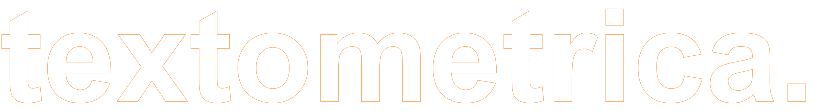

[*Textometrica*](https://web.archive.org/web/20120201063603/http://textometrica.humlab.umu.se/) was an application for combining quantitative content analysis, qualitative thematization, and network analysis, originally conceived by me, Simon Lindgren, and coded in PHP by Fredrik Palm at Humlab, Umeå University, in 2011.

This app, coded in Python by [Simon Lindgren](https://github.com/simonlindgren), makes the Textometrica workflow available anew. 

If you use this approach, conceived as CCA (Connected Concept Analysis), please cite:

> Lindgren, S. (2016). \"Introducing Connected Concept Analysis\". *Text & Talk*, 36(3), 341–362 [[doi](https://doi.org/10.1515/text-2016-0016)]

### Run the app on Streamlit Community Cloud

Run the app at [https://textometrica.streamlit.app/](https://textometrica.streamlit.app/).

### ... or run it locally on your computer

- Clone this repository.
- Make sure you have streamlit installed (`pip install streamlit`).
- Run `pip install -r requirements.txt`
- Run `streamlit run app.py`

